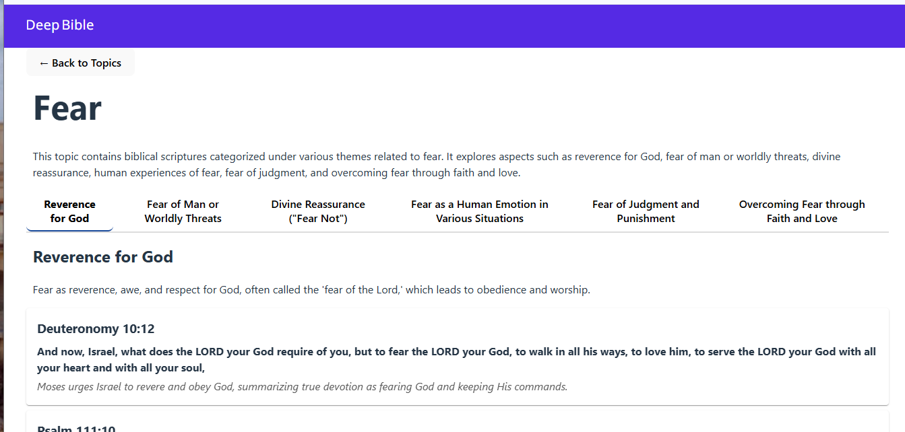

# deep-bible

Link: [Check out the Site](https://netware-326600.web.app/)

## 🌟 Description

Deep Bible offers a fast, modern way to explore Scripture by theme. Whether you're a student, teacher, or curious reader, you can:
- Effortlessly browse major biblical topics grouped by theme
- Read concise descriptions to grasp context at a glance
- Click “Read More” to dive into related articles and deeper studies
- Enjoy a fully responsive, mobile‑first UI built on Material Design
- Gain instant insight without searching verse references manually

Experience Scripture in a fresh, user‑friendly interface that brings clarity and inspiration to your study.

## 📷 Article Detail Page Preview

The main page displays a list of topic.

Clicking **Read More** on a topic card navigates to a detailed article view. Below is a wireframe mockup:

## 📖 Application Overview

Deep Bible is a React single-page application built with Vite and RMWC (React Material Web Components). It loads categorized scripture topics from JSON files and displays them as responsive cards. Each card shows a topic’s title and a truncated description, with a “Read More” button linking to related articles. The app is optimized for both desktop and mobile, leveraging Material Design for a clean, intuitive browsing experience.

This repository contains JSON schemas defining the structure for:

- Article collections (`schemas/articlesSchema.json`).
- Biblical scriptures organized by topic (`schemas/bibleScriptureSchema.json`).

## Data Schemas

### Articles Schema
File: `schemas/articlesSchema.json`

- **articles** (array): List of article objects.
  - **id** (string): Unique identifier.
  - **title** (string): Article title.
  - **author** (string): Author name.
  - **publishedDate** (string, date): Publication date.
  - **summary** (string): Brief summary or excerpt.
  - **content** (string): Main content (Markdown or HTML).
  - **topics** (array of string): Categories or topics.
  - **tags** (array of string): Tags for filtering.
  - *Required fields*: id, title, author, publishedDate, content.

### Bible Scripture Schema
File: `schemas/bibleScriptureSchema.json`

- **major_topics** (array): High‑level themes.
  - **title** (string): Major topic title (e.g., "Fear").
  - **description** (string): Detailed description of the topic.
  - **article_url** (string, URI): Link to an article/resource.
  - **categories** (array): Groupings within the topic.
    - **category_name** (string): Name of the category.
    - **category_description** (string): Explanation of the category.
    - **scriptures** (array): Scripture entries.
      - **reference** (string): Citation (book, chapter, verse).
      - **text** (string): Scripture text.
      - **context_description** (string): Contextual summary.
      - *Required fields*: reference, text, context_description.

All schemas enforce `additionalProperties: false` to reject unknown fields.

## Data Relationships

- **Article → Scripture**: In the Articles Schema, the `topics` array lists major topic titles (strings) that must exactly match the `title` field of a major topic in the Bible Scripture Schema (`major_topics[].title`). This establishes which scripture topics relate to each article.
- **Scripture → Article**: In the Bible Scripture Schema, each major topic includes an `article_url` (string, URI) that should point to the corresponding article resource, completing the bidirectional link between scriptures and articles.
 
## Links

- Frontend React SPA documentation: [frontend/README.md](./frontend/README.md)
- Pipeline Vars and Secrets: [README_pipe.md](./README_pipe.md)
- UI Design: [README_ui_design.md](./README_ui_design.md)
