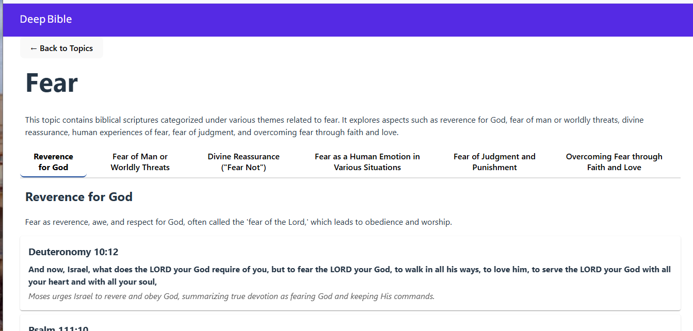

# UI Design and Layout

This document outlines the user interface design, layout, and component structure for the Deep Bible application.

## Overview
- Responsive single-page application built with React, Vite, and RMWC (Material Design)
- Mobile-first design that adapts across phone, tablet, and desktop
- Key sections:
 - Top App Bar (persistent navigation)
 - Home View: Grid of topic cards
 - Detail View: Topic header, category tabs, and scripture cards

The main page displays a list of topic.


Clicking **Read More** on a topic card navigates to a detailed article view. Below is a wireframe mockup:



## Color Palette
- Primary link/button accent: #646cff (hover: #535bf2)
- Tab active indicator: #0d47a1
- Card background: #fffff0
- Dark theme: text #ffffff on #242424
- Light theme: text #213547 on #ffffff
- Secondary/context text: #555555

## Typography
- Font family: system-ui, Avenir, Helvetica, Arial, sans-serif
- Body text: 1em, line-height 1.5
- Headings:
 - h1: 3.2em, line-height 1.1
 - h2/h3: default Material sizing
- Buttons: 1em, font-weight 500, rounded corners

## Layout Structure

### Top App Bar
- `TopAppBar` from RMWC, fixed at top
- Title aligned to start: “Deep Bible”
- Content offset using `.mdc-top-app-bar--fixed-adjust`

### Home View: Topics Grid
- Uses RMWC `Grid` and `GridCell` (12-column layout)
 - Desktop: 4 cards/row (`span=3`)
 - Tablet: 2 cards/row (`tablet=6`)
 - Phone: 1 card/row (`phone=12`)
- Cards maintain `aspect-ratio: 4/3` and full width
- Grid gap: 16px
- Card components:
 - Title (h2)
 - Description truncated to 3 lines (`-webkit-line-clamp: 3`)
 - “Read More” button at bottom

### Detail View
- Back button returns to home grid
- Topic header: title and description
- Category tabs:
 - Horizontal buttons with bottom border
 - Active tab: bold text, border-color #0d47a1
- Scripture list:
 - Each scripture as a `Card` with:
   - Reference (h3)
   - Text (bold)
   - Context description (italic)
 - Cards stacked vertically with 8px vertical margin

## Responsive & Accessibility
- Mobile-first breakpoints for grid and detail view
- Reduced motion support via `prefers-reduced-motion`
- Focus outlines on interactive elements
- Adequate color contrast for readability

## Component Hierarchy
```
App
├─ TopAppBar
└─ main
  └─ .container
     ├─ Home View
     │  └─ Grid
     │     └─ GridCell → Card (TopicCard)
     └─ Detail View
        ├─ BackButton
        ├─ TopicHeader
        ├─ Tabs
        └─ ScriptureList
           └─ Card (ScriptureCard)
```
